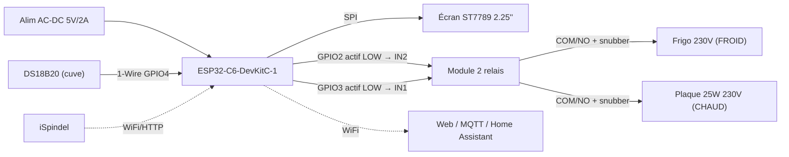

# FermCon — Contrôleur de fermentation (ESP32-C6)

Contrôleur autonome de fermentation de bière basé sur **ESP32-C6** (framework Arduino /
PlatformIO). Il régule la température d'une cuve (froid + chaud), reçoit les mesures d'un
**iSpindel**, les redistribue vers **MQTT** ou **Grainfather**, expose une **interface web**
protégée avec **OTA**, et affiche l'état sur un écran **ST7789**.

> État : **v0.1.0** — premier build compilant et linkant pour la cible ESP32-C6
> (`pio run -e esp32-c6` = SUCCESS, Flash 42,5 %, RAM 15,6 %). Voir `CHANGELOG.md`.

---

## Sommaire

- [Fonctionnalités](#fonctionnalités)
- [Matériel](#matériel)
  - [Architecture](#architecture)
  - [Attribution des actionneurs](#attribution-des-actionneurs-définitive)
  - [Brochage ESP32-C6](#brochage-esp32-c6)
  - [Câblage détaillé](#câblage-détaillé)
    - [Côté commande — module relais](#côté-commande--module-relais-basse-tension)
    - [Côté puissance (230 V)](#côté-puissance-230-v-déporté)
    - [Sonde & écran](#sonde--écran)
  - [BOM](#bom)
  - [Sécurité — points clés](#sécurité--points-clés)
  - [Comportement fonctionnel](#comportement-fonctionnel)
- [Architecture logicielle](#architecture-logicielle)
- [Modules](#modules)
- [Prise en main (build & flash)](#prise-en-main-build--flash)
- [Configuration (`include/Config.h`)](#configuration-includeconfigh)
- [Interface web & API HTTP](#interface-web--api-http)
- [Format des données iSpindel / redistribution](#format-des-données-ispindel--redistribution)
- [Dépendances (PlatformIO `lib_deps`)](#dépendances-platformio-lib_deps)
- [Structure du projet](#structure-du-projet)
- [Dépannage](#dépannage)

---

## Fonctionnalités

- **Régulation de température** par hystérésis (±1 °C) avec 2 sorties exclusives FROID / CHAUD.
  - Anti-court-cycle compresseur : OFF minimum 5 min (300 s), marche minimale froid 120 s / chaud 60 s.
  - Repli sûr : sonde en erreur → les 2 sorties sont coupées (état FAULT).
  - Timeout de sécurité sur maintien anormalement long (`MAX_ON_TIMEOUT_S`).
  - Régulation **prioritaire et autonome**, fonctionne même hors ligne.
- **Profils de fermentation** : paliers + rampes persistants (LittleFS), consigne recalculée
  en fonction du temps écoulé.
- **Réception iSpindel** : endpoint HTTP POST JSON (`name, ID, temperature, temp_units,
  gravity, angle, battery, RSSI`).
- **Redistribution** configurable à chaud : **MQTT** (Mosquitto) *ou* **Grainfather**
  (HTTP POST au format iSpindel, device suffixé `_SG`).
- **Interface web** : réglages, profils, état temps réel — auth simple. **OTA** via ElegantOTA (`/update`).
- **Écran ST7789** 2.25" portrait (76×284) : température géante, consigne, densité (SG),
  jour/étape de fermentation, état des connexions, IP.

---

## Matériel

> Version matérielle : **v1.1** — *SSR supprimé, deux voies sur module relais mécanique.*
> Dernière révision : 2026-07-09

FermCon maintient une cuve de fermentation à consigne en pilotant **un frigo** (froid) et **une plaque chauffante 25 W** (chaud), d'après la température lue par une sonde **DS18B20**. Il expose un **serveur web** (WiFi), ingère les données d'un **iSpindel** (densité + température) et affiche l'état sur un **écran TFT**.

La **régulation est prioritaire et autonome** : elle fonctionne même hors ligne. Le Wi-Fi ne sert qu'à la télémétrie (iSpindel, MQTT, Grainfather), à l'interface web et à l'OTA.

> Le brochage complet est également disponible dans `WIRING.md`. Toute modification de brochage doit être répercutée dans `include/Config.h`.

### Architecture

- **Contrôleur** : ESP32-C6-DevKitC-1 (WiFi, logique, serveur web, régulation).
- **Mesure** : sonde DS18B20 étanche (1-Wire) sur la cuve.
- **Affichage** : écran TFT ST7789 2.25" (SPI).
- **Actionneurs** : module 2 relais mécaniques opto-isolés — **1 canal froid (IN2) + 1 canal chaud (IN1)**.
- **Puissance déportée** : tout le 230 V est câblé hors carte (borniers, fusibles, snubbers).
- **Alimentation** : module AC-DC 5 V / 2 A → rail 5 V + logique 3,3 V du DevKit.



### Attribution des actionneurs (DÉFINITIVE)

| Charge | Actionneur | Commande | Niveau actif | Protections |
|---|---|---|---|---|
| **FROID — frigo** | Relais mécanique **canal 2 (IN2)** | GPIO2 | **Actif LOW** | Snubber RC (contact) + fusible T6,3 A 🔶 + câble ≥ 1,5 mm² |
| **CHAUD — plaque 25 W** | Relais mécanique **canal 1 (IN1)** | GPIO3 | **Actif LOW** | Snubber RC (contact) + fusible T3,15 A + câble ≥ 0,75 mm² |

> ❌ **SSR-40DA supprimé** du projet (conservé pour un autre usage). Les deux voies sont désormais des relais mécaniques → **mode de défaut « ouvert »** (contrôleur planté = frigo ET plaque coupés = état sûr).

### Brochage ESP32-C6

⚠️ Éviter GPIO8/9/15 (strapping) et GPIO12/13 (USB natif).

| Fonction | GPIO | Interface | Remarque |
|---|---|---|---|
| DS18B20 (données) | GPIO4 | 1-Wire | Pull-up 4,7 kΩ vers 3V3 **obligatoire** |
| Sortie FROID | GPIO2 | GPIO → IN2 | Actif LOW + **pull-up 10 kΩ vers 3V3** (état OFF au boot) |
| Sortie CHAUD | GPIO3 | GPIO → IN1 | Actif LOW + **pull-up 10 kΩ vers 3V3** (état OFF au boot) |
| Écran SCLK | GPIO6 | SPI | — |
| Écran MOSI | GPIO7 | SPI | — |
| Écran CS | GPIO10 | SPI | — |
| Écran DC | GPIO11 | SPI | — |
| Écran RST | GPIO21 | GPIO | — |
| Écran BL | GPIO22 | PWM | Rétroéclairage |

### Câblage détaillé

#### Côté commande — module relais (basse tension)

**Retirer le cavalier VCC–JD_VCC** pour une isolation galvanique réelle.

Le module 2 canaux possède un bloc 3 broches côté alim sérigraphié `GND · VCC · JD_VCC`, avec un shunt reliant VCC ↔ JD_VCC.

```
   [ GND ]  [ VCC ]  [ JD_VCC ]
              └──shunt──┘   ← à retirer
```

- **Retirer** le capuchon plastique et le conserver.
- **Vérifier** au multimètre (continuité) : entre `VCC` et `JD_VCC`, **plus de bip** = cavalier bien absent.
- Puis câbler : `VCC` = 3,3 V (opto/logique), `JD_VCC` = 5 V (bobine), `GND` commun.

Sans cette séparation, un GPIO à 3,3 V laisse ~1,7 V sur l'entrée du module et le relais risque de ne pas retomber proprement.

| De | Vers | Rôle |
|---|---|---|
| ESP32-C6 3V3 | VCC (opto) | Référence logique 3,3 V |
| Alim 5 V | JD_VCC | Alimente les bobines (>100 mA) |
| GND | GND | Masse commune |
| GPIO3 | IN1 | Commande CHAUD (actif LOW) |
| GPIO2 | IN2 | Commande FROID (actif LOW) |
| 10 kΩ | IN1→3V3 et IN2→3V3 | **Pull-ups : relais OFF au boot** |

#### Côté puissance (230 V, déporté)

```
Phase ──[fusible T]──► COM ──(contact)──► NO ──► Phase charge (frigo / plaque)
Neutre ─────────────────────────────────────────► Neutre charge (direct)
Terre (PE) ──────────────────────────────────────► Terre charge (direct)

Snubber RC ⇒ aux bornes du contact (COM–NO) de CHAQUE canal
```

- On commute **uniquement la phase**, jamais le neutre ni la terre.
- **COM + NO** → charge éteinte au repos (sûr).
- **Snubber RC** aux bornes de chaque contact — le canal frigo (inductif) est le plus critique.
- Snubber prévu pour le secteur (condensateur X2, RC ≥ 250 V AC), sans polarité.

#### Sonde & écran

| De | Vers | Remarque |
|---|---|---|
| DS18B20 VDD | 3V3 | Mode 3 fils (pas de parasite power) |
| DS18B20 DQ | GPIO4 | + pull-up 4,7 kΩ vers 3V3 |
| DS18B20 GND | GND | — |
| Écran VCC/GND | 3V3 / GND | + 100 nF de découplage |
| Écran SCLK/MOSI/CS/DC/RST/BL | GPIO6/7/10/11/21/22 | SPI |

### BOM

| # | Composant | Qté | Rôle | Tension | Statut |
|---|---|---|---|---|---|
| 1 | ESP32-C6-DevKitC-1 | 1 | Contrôleur | 5 V / 3,3 V | ✅ |
| 2 | DS18B20 étanche | 1 | Sonde T° cuve | 3,3 V | ✅ |
| 3 | Résistance 4,7 kΩ | 1 | Pull-up 1-Wire | — | ✅ |
| 4 | Résistance 10 kΩ | 2 | Pull-up IN1/IN2 (état OFF boot) | — | ➕ Ajouté |
| 5 | Écran TFT ST7789 2.25" | 1 | Affichage | 3,3 V | ✅ |
| 6 | Module 2 relais opto-isolé | 1 | FROID (IN2) + CHAUD (IN1) | 5 V bobine / 3,3 V cmd | ✅ |
| 7 | Snubber RC | 2 | Protection contacts (froid + chaud) | 230 V | ✅ |
| 8 | Alim AC-DC 5 V / 2 A | 1 | Alimentation | 220 V → 5 V | ✅ |
| 9 | Condensateur 470–1000 µF / 16 V | 1 | Réservoir 5 V | 5 V | ✅ |
| 10 | Condensateur 100 nF | 1–2 | Découplage HF | — | ✅ |
| 11 | Fusible T6,3 A + porte-fusible | 1 | Protection froid | 230 V | 🔶 |
| 12 | Fusible T3,15 A + porte-fusible | 1 | Protection chaud | 230 V | 🔶 |
| 13 | Borniers à vis, câblage, PE, boîtier | — | Connectique / mécanique | — | 🔶 |
| 14 | iSpindel (externe) | 1 | Suivi densité | — | ✅ |
| — | ~~SSR-40DA~~ | ~~1~~ | ~~Froid~~ | — | ❌ Retiré |

### Sécurité — points clés

- 🟢 **Deux voies en défaut « ouvert »** : panne/coupure = charges coupées.
- 🟢 **Aucun 230 V sur la logique** — puissance déportée en zone dédiée.
- **Cavalier JD_VCC retiré** → isolation galvanique effective.
- **Pull-ups 10 kΩ** garantissant l'état OFF des relais au démarrage.
- **Snubbers RC** aux bornes de chaque contact (frigo inductif = prioritaire).
- **Fusibles temporisés** calibrés par branche (protègent le matériel + risque incendie ; les personnes sont protégées par le différentiel du tableau).
- **Terre (PE)** raccordée à toute masse métallique.
- **Anti-court-cycle compresseur** (logiciel) : OFF min 300 s, marche min froid 120 s.
- **Repli sûr** : sonde DS18B20 en erreur (−127 / 85 °C) → les deux sorties coupées (FAULT).
- 🔶 Niveaux logiques : tout est 3,3 V côté ESP32 → aucun conflit 5 V/3,3 V.

### Comportement fonctionnel

- Régulation double-consigne froid/chaud avec **hystérésis**, **exclusivité** et **anti-court-cycle** (≥ 5 min recommandé sur le frigo).
- **Les deux sorties sont actif LOW** (GPIO HAUT = relais OFF).
- **Repli sûr** : défaut sonde → couper les deux sorties.
- **Régulation autonome** hors WiFi/MQTT ; reconnexion transparente.
- **Persistance** config + profil.
- **Ingestion iSpindel** (densité + température) sans bloquer la régulation.
- Serveur web + intégration MQTT/Home Assistant.

---

## Architecture logicielle

Boucle Arduino classique (`setup()` / `loop()`) orchestrée dans `src/main.cpp`. Chaque
responsabilité est isolée dans un module, instancié une fois puis piloté par `loop()` :

```
                         ┌───────────────────────────────────────────────┐
                         │                  main.cpp                      │
                         │   setup(): begin() de tous les modules         │
                         │   loop() : cadence non bloquante (millis)      │
                         └───────────────────────────────────────────────┘
        WiFi / HTTP POST         │                 │                 │
   iSpindel ─────────────► ISpindelReceiver        │                 │
                                 │ (parsePayload)   │                 │
                                 ▼                  ▼                 ▼
                          FermentationInfo    DataPublisher     WebServerManager
                          (jours, étape,      (MQTT ou           (UI + API + OTA,
                           densité départ)     Grainfather)       auth simple)
                                 │                                     │
   DS18B20 ──► TemperatureController ──► RelayController ──► FROID / CHAUD (relais)
                     ▲   (hystérésis, anti-court-cycle,
                     │    FAULT, timeout)
              ProfileManager (consigne = f(temps) via paliers + rampes)
                                 │
   ConfigStore (LittleFS: /config.json, /profile.json, /fermentation.json)
                                 │
                          DisplayManager (ST7789, LovyanGFX)
```

**Principes clés :**
- **La régulation est prioritaire et autonome** : elle tourne même sans réseau. Un échec
  WiFi/MQTT/redistribution ne bloque jamais `TemperatureController`.
- **Non bloquant** : aucune fonction longue dans `loop()` ; les périodes (lecture sonde,
  reconnexion WiFi, refresh écran) sont cadencées via `millis()`.
- **Persistance** sur LittleFS : configuration, profil actif et infos de fermentation
  survivent au redémarrage.

---

## Modules

| Module (`include/` + `src/`) | Rôle |
|---|---|
| `main` | Point d'entrée : instancie les modules, câble les dépendances, orchestre `loop()`. |
| `Config.h` | Constantes de compilation : brochage, polarités, seuils de régulation, timings. |
| `ConfigStore` | Persistance LittleFS. Expose `SystemConfig` (wifi, mqtt, grainfather, auth, consigne, hystérésis…) et `SystemStatus`. `save()/load()`, `saveProfile()/loadProfile()`, `saveFermentation()/loadFermentation()`. |
| `TemperatureController` | Machine à états IDLE / COOLING / HEATING / FAULT. Hystérésis, anti-court-cycle, timeout, repli sûr sonde. Lit le DS18B20 (DallasTemperature / OneWireNg). |
| `RelayController` | Pilotage bas niveau des 2 sorties FROID / CHAUD avec exclusivité garantie et polarités paramétrables. |
| `ProfileManager` | Profils de fermentation (paliers + rampes, max 16 étapes). Interpolation de la consigne selon le temps écoulé. `toJson()/fromJson()`. |
| `FermentationInfo` | Suivi de la fermentation : jour courant, libellé d'étape (libre), densité de départ, atténuation. |
| `ISpindelReceiver` | Parsing du JSON iSpindel (`parsePayload()`), gestion des payloads multi-chunk. |
| `DataPublisher` | Redistribution des mesures vers MQTT (PubSubClient) **ou** Grainfather (HTTP POST). Reconnexion auto, jamais bloquant. |
| `WebServerManager` | Serveur async (ESPAsyncWebServer) : sert l'UI (`data/web`), API REST, auth HTTP Basic, intègre ElegantOTA. |
| `DisplayManager` | Rendu écran ST7789 via LovyanGFX (`LGFX_Config.hpp`), layout portrait 76×284, rétroéclairage PWM. |

---

## Prise en main (build & flash)

Prérequis : [PlatformIO](https://platformio.org/) (CLI ou extension VSCode).

> ⚠️ **Windows** : placer le projet dans un chemin **sans accent ni espace**
> (ex. `C:\dev\FermCon`). Un accent (ex. `Téléchargements`) fait échouer GNU `ld`
> à la création de `firmware.map`.

```bash
# Compiler
pio run -e esp32-c6

# Flasher le firmware
pio run -e esp32-c6 -t upload

# Uploader le système de fichiers (interface web data/web) — à refaire à chaque modif de data/web
pio run -e esp32-c6 -t buildfs
pio run -e esp32-c6 -t uploadfs

# Moniteur série (115200)
pio device monitor -e esp32-c6
```

Au premier boot sans Wi-Fi configuré, WiFiManager ouvre un point d'accès de configuration.
Une fois connecté : interface sur `http://<IP>/`, OTA sur `http://<IP>/update`.

---

## Configuration (`include/Config.h`)

Toutes les constantes de compilation (brochage, polarités, seuils) sont centralisées ici.
Les réglages runtime (WiFi, MQTT, consigne, auth…) sont modifiables via l'interface web et
persistés dans `/config.json`.

| Paramètre | Défaut | Description |
|---|---|---|
| Hystérésis | 1.0 °C | Bande morte autour de la consigne. |
| OFF min compresseur | 300 s | Délai mini avant redémarrage du froid (anti-court-cycle). |
| ON min froid / chaud | 120 s / 60 s | Marche minimale avant extinction. |
| Timeout maintien | 7200 s | Coupure de sécurité si une sortie reste ON anormalement longtemps. |
| Consigne par défaut | 18.0 °C | Utilisée sans profil actif. |
| Intervalle lecture sonde | 2000 ms | Période d'échantillonnage du DS18B20. |
| Erreurs sonde | -127 / 85 °C | Valeurs DS18B20 traitées comme FAULT. |

### Calibration écran
Le panneau 76×284 est plus petit que la GRAM du ST7789 : offsets de départ `82 / 18`
dans `include/LGFX_Config.hpp`, à ajuster de ±2 jusqu'à ce qu'un cadre plein écran touche
les 4 bords.

---

## Interface web & API HTTP

Servie depuis LittleFS (`data/web/`), protégée par **auth HTTP Basic** (identifiants dans
la config, à changer au premier boot). Endpoints principaux :

| Méthode | Route | Rôle |
|---|---|---|
| `GET` | `/` | Interface web (fichiers statiques depuis `/web/` sur LittleFS). |
| `POST` | `/ispindel` | Réception des mesures iSpindel (JSON, multi-chunk géré). |
| `GET` | `/api/status` | État temps réel (température, consigne, sorties, connexions). |
| `GET` / `POST` | `/api/config` | Lecture / mise à jour de la configuration. |
| `POST` | `/api/setpoint` | Réglage direct de la consigne. |
| `POST` | `/api/manual` | Commande manuelle des sorties FROID / CHAUD. |
| `GET` / `POST` | `/api/profile` | Lecture / édition du profil de fermentation. |
| `POST` | `/api/profile/activate` | Activation du profil (démarre le calcul de consigne). |
| `GET` / `POST` | `/api/fermentation` | Lecture / mise à jour des infos de fermentation. |
| `GET` / `POST` | `/update` | OTA firmware (ElegantOTA, même auth que l'UI). |

> 🔒 L'auth est volontairement simple (HTTP Basic). Ne pas exposer l'appareil directement
> sur Internet ; le garder sur le réseau local.

---

## Format des données iSpindel / redistribution

Payload iSpindel attendu sur `POST /ispindel` :

```json
{ "name": "iSpindel", "ID": 1, "temperature": 21.5, "temp_units": "C",
  "gravity": 1.050, "angle": 45.0, "battery": 3.7, "RSSI": -60 }
```

Redistribution (configurable à chaud) :
- **MQTT** (Mosquitto) : publication des champs sur le broker configuré.
- **Grainfather** : HTTP POST au format iSpindel, avec le nom de device suffixé `_SG`.

---

## Dépendances (PlatformIO `lib_deps`)

LovyanGFX · ArduinoJson 7 · ElegantOTA · WiFiManager · ESPAsyncWebServer + AsyncTCP ·
PubSubClient · DallasTemperature · **OneWireNg**.

Notes de compatibilité ESP32-C6 (déjà intégrées dans `platformio.ini`) :
- **OneWireNg** remplace `paulstoffregen/OneWire` (incompatible C6). `lib_ignore = OneWire`
  neutralise le OneWire de PaulStoffregen tiré en transitif.
- **ElegantOTA** en mode async via `-D ELEGANTOTA_USE_ASYNC_WEBSERVER=1`.
- Table de partitions **`default_8MB.csv`** + flash 8 Mo (double slot OTA + FS LittleFS).

---

## Structure du projet

```
FermCon/
├── include/            Headers (Config, ConfigStore, DisplayManager, WebServerManager,
│                       ProfileManager, RelayController, TemperatureController,
│                       ISpindelReceiver, DataPublisher, FermentationInfo, LGFX_Config.hpp)
├── src/                Implémentations (.cpp) + main.cpp
├── data/web/           Interface web (index.html, app.js, style.css) → LittleFS
├── platformio.ini      Environnement esp32-c6 (cible)
├── WIRING.md           Câblage matériel
├── CHANGELOG.md
└── VERSION
```

---

## Dépannage

| Symptôme | Cause probable / solution |
|---|---|
| `ld` échoue sur `firmware.map` | Chemin du projet avec accent/espace → déplacer dans `C:\dev\FermCon`. |
| Erreurs `OneWire` à la compilation | Vérifier `lib_ignore = OneWire` (neutralise PaulStoffregen au profit d'OneWireNg). |
| Température figée à -127 / 85 °C | Défaut de câblage DS18B20 / pull-up → l'état passe en FAULT, sorties coupées. |
| UI web absente après flash | Oublier `uploadfs` : refaire `pio run -e esp32-c6 -t buildfs && ... -t uploadfs`. |
| Le froid ne redémarre pas | Normal si < 5 min depuis la dernière extinction (anti-court-cycle). |
| Écran décentré / rogné | Ajuster les offsets `82 / 18` dans `include/LGFX_Config.hpp`. |
| Relais ne retombe pas (FROID ou CHAUD) | Vérifier que le cavalier JD_VCC est bien retiré du module relais. |
